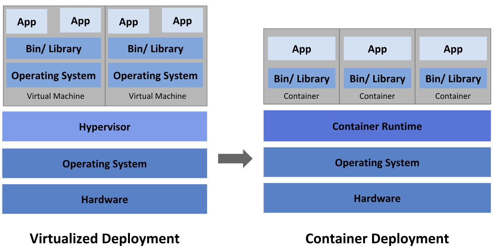

# VMs vs Docker

## Hypervisor
ကျွန်တော်တို့ Virtual Machine အကြောင်းမပြောခင်မှာ VM တွေ run ဖို့အတွက်လိုအပ်တဲ့ Hypervisor အ‌ကြောင်းကိုအနည်းငယ်လေး sharing လုပ်ပေးပါမယ်။ Hypervisor ဆိုတာက vm နဲ့ hardware ကြားဆက်သွယ်ပေးတဲ့ software layer တစ်ခုဖြစ်ပြီးတော့ host တစ်ခုတည်းပေါ်မှာပဲ vm တွေအများကြီးကိုသူတို့နဲ့သက်ဆိုင်ရာ own program အလိုက် run လို့ရအောင်လုပ်ပေးတဲ့ software layer တစ်ခုဖြစ်ပါတယ်။ Hypervisor မှာမှ Type 1 hypervisor ရယ် Type 2 hypervisor ရယ်ဆိုပြီးနှစ်ခုရှိပါတယ်။  
- **Type 1 Hypervisor** => Type 1 ရဲ့ သဘောက Underlying Operating System မလိုပဲ Hardware ပေါ်မှာပဲတိုင်ရိုက်တင်ပြီး run တဲ့ Virtualization Technology ဖြစ်ပါတယ်။ (Example - VMWare ESXI, Proxmox)
- **Type 2 Hypervisor** => Type 2 ကျတော့သက်ဆိုင်ရာ Underlying Operating System တစ်ခုရှိမယ် အဲ့ Operating System ပေါ်မှာမှ Hypervisor Software တစ်ခုခုကိုတင်ပြီးတော့ vm တွေကို run တာဖြစ်ပါတယ်။ (Example - VMware Workstation, Virtual Box)

## Virtual Machine vs Docker
### Virtual Machine
- Virtual Machine ဆိုတာက Operating System,Server,Storage,Device,Network စတာတွေကို virtual version တစ်ခုအနေနဲ့ create လုပ်ပြီးတော့သုံးတာမျိုးဖြစ်ပါတယ်။ Multiple Operating System vm တွေကို hypervisor ပေါ်မှာတင်ပြီး run တာမျိုးဖြစ်တဲ့အတွက် hardware cost နဲ့ recource သုံးချမှုကိုလဲလျော့ကျစေပါတယ်။ VM ထဲမှာမှ သက်ဆိုင်ရာ application တစ်ခု run ဖို့အတွက်လိုအပ်တဲ့ Operating System,bin,library စတာတွေကို run ပြီးတော့သုံးတဲ့ virtualization technology တစ်ခုဖြစ်ပါတယ်။
### Docker
- Container (Docker) မှာကျတော့သူက hypervisor layer ကိုထပ်ပြီးသုံးစရာမလိုပဲ Underlying Operating System ပေါ်မှာပဲ Container engine (Docker Engine) ကို run ပြီးတော့ containerize application တွေကို run တာမျိုးဖြစ်ပါတယ်။