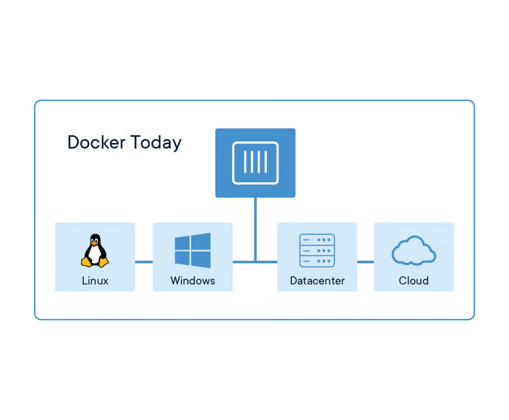

# What is Containerization
Containerization ဆိုတာကတော့ software application တစ်ခုကို ၎င်းနဲ့သက်ဆိုင်တဲ့ code တွေ file တွေ libraries တွေနဲ့အတူ တစ်စုတစ်စည်းတည်း ထုပ်ပိုးပြီး မည်သည့် infrastructure (သို့) platform ပေါ်မှာမဆို အလုပ်လုပ်စေနိုင်တဲ့ နည်းပညာတစ်ခုပဲဖြစ်ပါတယ်။ အဲ့ဒီထဲမှာမှ အအောင်မြင်ဆုံးဖြစ်ပြီးလက်ရှိမှာလဲ တွင်တွင်ကျယ်ကျယ်သုံးနေသည့် Docker ဆိုသည့် Tool အကြောင်းကို ပြောပြပေးမှာပဲဖြစ်ပါတယ်။

Docker ဆိုသည့် Container Technology ကိုတော့ 2013 ခုနှစ်မှာ Open source Project အဖြစ်နဲ့ Solomon Hykes ဆိုသူက Docker Container Engine ကို launched လုပ်ခဲ့ပါတယ်။ Docker သည် containerization နည်းပညာကို လူသိများစေခဲ့ပြီး၊ DevOps နှင့် Cloud Computing တွင် အတော်လေး အရေးပါသော ပြောင်းလဲမှုတစ်ခု ဖြစ်စေခဲ့သည်။

Docker သည်

