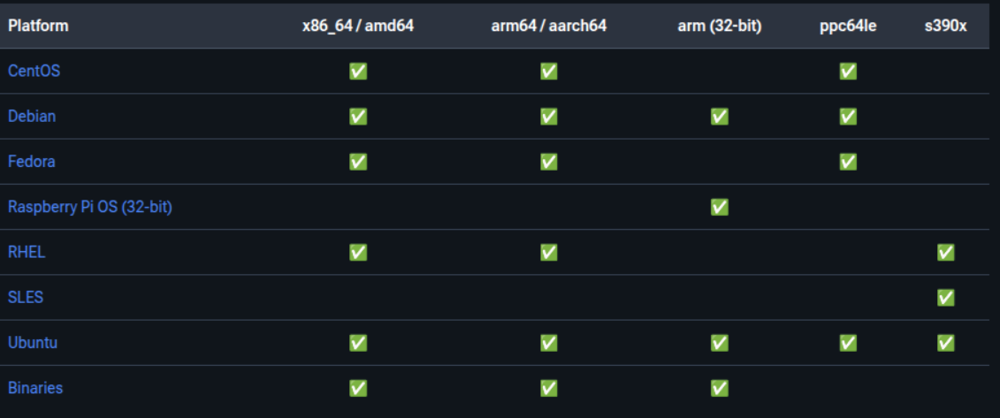

# Docker Installation

Docker ရဲ့အကြောင်းလဲ တီးမိခေါက်မိရှိပြီဆိုတော့ ဆက်ပြီးတော့ ကျွန်တော်တို့ Docker Installation ဘယ်လိုလုပ်မလဲဆိုတာကို ဆက်သွားကြရအောင်။ လက်ရှိဤစာအုပ်ကို Ubuntu Os ပေါ်တွင် ရေးသားနေသည့် အတွက် Ubuntu ပေါ်မှာ Docker Installation Step by Step ကိုတော့ ရေးသားပေးမှာပဲဖြစ်ပါတယ်။ Windows, macOS တို့မှာဆိုရင်တော့ Docker Desktop ကို Installation လုပ်ပြီး Docker Engine ကိုအသုံးပြုနိုင်ပါတယ်။

Support လုပ်သည့် Platform တွေကိုတော့ အောက်ကပုံထဲမှာပြပေးထားပါတယ်။



Docker Engine မှာဆိုရင် CE နဲ့ EE ဆိုပြီးရှိပါတယ်။ CE ကတော့ Community Edition ဖြစ်သည့် အတွက် အခမဲ့အသုံးပြုနိုင်မှာဖြစ်ပြီး Enterprise Edition(EE) ဝယ်ပြီးအသုံးပြုမှာပဲဖြစ်ပါတယ်။


## Install Docker Engine on Ubuntu

Docker Engine ကို Installation မလုပ်ခင် လိုအပ်တဲ့ Requirement တွေကို Check ချင်ရင်တော့အောက်ကပေးထားတဲ့ link မှာသွားပြီး check နိုင်ပါတယ်။

**Check** [Prerequisites](https://docs.docker.com/engine/install/ubuntu/#prerequisites)

## Installation methods
Docker Engine ကို Installation လုပ်ဖို့အတွက် methods တွေကတော့ 
- Docker Desktop
- Install Docker Engine from Docker's 'apt' repository
- convenience script (Only recommended for testing and development environments) 
  
ဆိုပြီးရှိပါတယ်။ 

## Method 1: Docker Desktop
Docker Desktop ကိုတော့ Mac နဲ့ Windows environment တွေမှာ အလွယ်တကူ Installation ပြုလုပ်ပြီးအသုံးပြုနိုင်အောင်ဖန်တီးထားခြင်းဖြစ်ပါသည်။ Docker Desktop ထဲမှာဆိုရင် Docker Engine, Docker CLI client, Docker Compose, Dcoker Content Trust, Kubernetes စသဖြင့်ပါဝင်ပြီးသားဖြစ်ပြီး Installation ပြုလုပ်ပြီးတာနဲ့အဆင်သင့် အသုံးပြုလို့ရအောင် ပြုလုပ်ထားခြင်းပဲဖြစ်ပါတယ်။

Docker Desktop ကို အသုံးပြုချင်ရင်တော့ အောက်ပါ link မှာသွားရောက် download ဆွဲယူနိုင်ပါတယ်။ 
website: [https://www.docker.com/products/docker-desktop](https://www.docker.com/products/docker-desktop)

## Method 2: Install using the **apt** repository

1. Setup Docker's apt repository.
```
# Add Docker's official GPG key:
sudo apt-get update
sudo apt-get install ca-certificates curl
sudo install -m 0755 -d /etc/apt/keyrings
sudo curl -fsSL https://download.docker.com/linux/ubuntu/gpg -o /etc/apt/keyrings/docker.asc
sudo chmod a+r /etc/apt/keyrings/docker.asc

# Add the repository to Apt sources:
echo \
  "deb [arch=$(dpkg --print-architecture) signed-by=/etc/apt/keyrings/docker.asc] https://download.docker.com/linux/ubuntu \
  $(. /etc/os-release && echo "${UBUNTU_CODENAME:-$VERSION_CODENAME}") stable" | \
  sudo tee /etc/apt/sources.list.d/docker.list > /dev/null
sudo apt-get update

```

2. Install the Docker packages.

#### To install the latest version, run:

```
sudo apt-get install docker-ce docker-ce-cli containerd.io docker-buildx-plugin docker-compose-plugin
```
3. Verify that the installation is successful by running the hello-world image:

```
sudo docker run hello-world
```
## Method 3: Convenience Script
Convenience Script ဆိုတာကတော့ သက်ဆိုင်ရာ linux distro အလိုက်ကို docker က provides လုပ်ပေးထားတဲ့ script နဲ့ automatically detects လုပ်ပြီးတော့ docker ကို install ပြုလုပ်ခြင်းပဲဖြစ်ပါတယ်။

#### Docker Installation Script:
```
curl -fsSL https://get.docker.com -o get-docker.sh
sudo sh ./get-docker.sh
```
#### Enable Docker to start on boot
```
sudo systemctl enable docker
```
ဒီ Method ကတော့ Testing Environemnts အတွက်အသုံးပြုချင်ရင်တော့ quick setup အနေနဲ့အသုံးပြုလို့ရမည်ဖြစ်ပြီးတော့ production environments အတွက်အသုံးပြုချင်ရင်တော့ manual installation method ကိုသာရွေးချယ်အသုံးပြုဖို့ အကြံပေးချင်ပါတယ် ခင်ဗျာ။

ယခုရေးသားထားသော installation method များသည် docker official documentation ကနေ reference ယူထားခြင်းပဲဖြစ်ပါသည်။ Documentation မှ တိုက်ရိုက်ကြည့်ပြီး Install လုပ်ချင်လျှင်လည်း လုပ်လို့ရအောင် Official Documentation Link လဲထည့်ပေးထားပါတယ်။

*Official Documentation Link*: [Install Docker Engine on Ubuntu](https://docs.docker.com/engine/install/ubuntu/#install-using-the-repository)